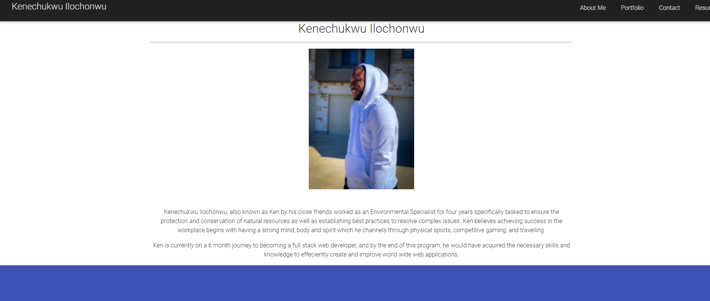

# react-portfolio

**React Challenge**

**Version 1.17.0**

**Build a portfolio using react, challenge activity.**

The aim of this challenge is to build a mobile first and responsive portfolio using react technology. This project enables employers to view a potential employee's deployed React portfolio of work samples and assess whether they're a good candidate for an open position.

**This project follows the criteria below:**

- GIVEN a single-page application portfolio for a web developer, when I load the portfolio, then I am presented with a page containing a header, a section for content, and a footer.
- WHEN I view the header, then I am presented with the developer's name and navigation with titles corresponding to different sections of the portfolio.
- WHEN I view the navigation titles, then I am presented with the titles About Me, Portfolio, Contact, and Resume, and the title corresponding to the current section is highlighted.
- WHEN I click on a navigation title then I am presented with the corresponding section below the navigation without the page reloading and that title is highlighted.
- WHEN I load the portfolio the first time, then the About Me title and section are selected by default.
- WHEN I am presented with the About Me section, then I see a recent photo or avatar of the developer and a short bio about them.
- WHEN I am presented with the Portfolio section, then I see titled images of six of the developer’s applications with links to both the deployed applications and the corresponding GitHub repository.
- WHEN I am presented with the Contact section, then I see a contact form with fields for a name, an email address, and a message.
- WHEN I move my cursor out of one of the form fields without entering text, then I receive a notification that this field is required.
- WHEN I enter text into the email address field, then I receive a notification if I have entered an invalid email address.
- WHEN I am presented with the Resume section, then I see a link to a downloadable resume and a list of the developer’s proficiencies.
- WHEN I view the footer, then I am presented with text or icon links to the developer’s GitHub and LinkedIn profiles, and their profile on a third platform (Stack Overflow, Twitter) 
Mock-Up.

## Built With

- React Technology
- Material Design Bootstrap

## Work Completed

**A successful completion of this project is subject to attaining the above criteria:**

## Project Visual

## Github pages and links

**This project has been deployed to GitHub Pages.** 

- [Github Deploy](https://kenesei91.github.io/react-portfolio/)
- [Github Pages](https://github.com/kenesei91/react-portfolio)
- [Walkthrough](https://watch.screencastify.com/v/rfG0opCIbblLU2LQPonO)
- [Heroku](https://guarded-journey-14501.herokuapp.com/)

## Contributors/Contact

- Kenechukwu K Ilochonwu <keneilo91@yahoo.com>

## Licence & Copyright

© Kenechukwu K Ilochonwu, Web Project Design

Licensed under the [LICENSE] (MIT LICENSE)
